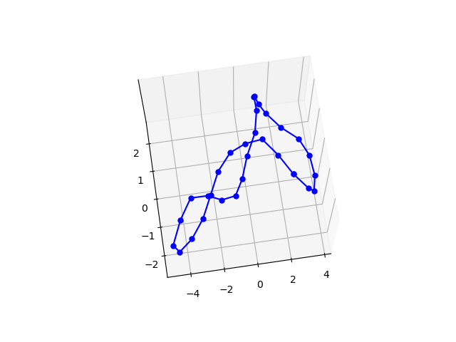
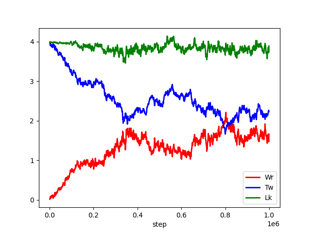

以下の2つの論文を参考にして、Circular DNAのsuper coilingに関した
シミュレーションを行うプログラムを作成した。

[1] : 

[2] :

初期配置として
total twist  Tw = 
writhing     Wr = 0 
(Linking number Lk = )
の円形から100万ステップ回したときの最終的な配置

また、各ステップにおけるTw,Wr,Lkをplotしたもの

